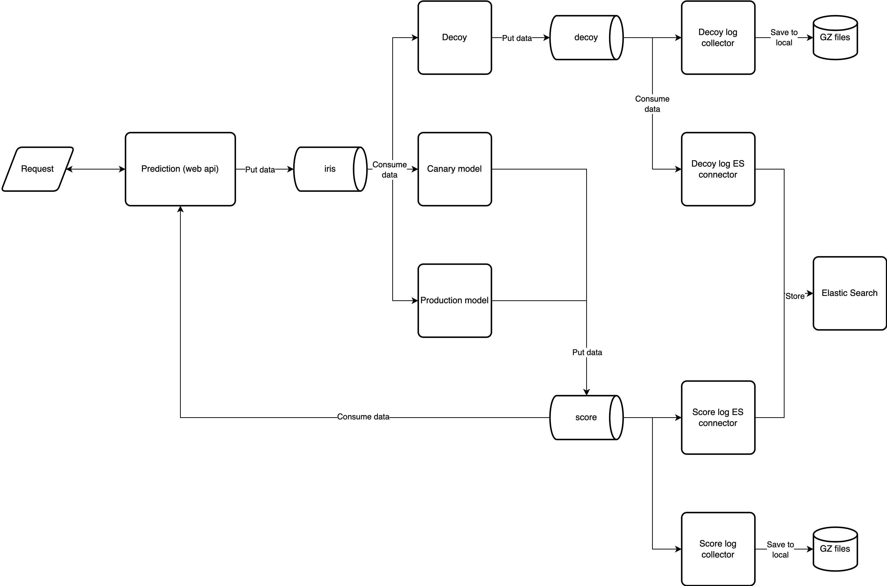

# Simple Implementation of Rendezvous Architecture for Machine Learning Service

## Architecture Diagram



## How to Use

1. Install docker and docker compose.
2. Create conda environment
   ```bash
   conda env create -f env_mac.yaml
   conda activate rendezvous_arch
   ```
3. Train `canary` and `production` model
    ```bash
   make train-canary
   ```
   ```bash
   make train-model
   ```

4. Deploy services
   ```bash
   make up
   ```
   Wait for several minutes until all services are ready.
5. Make an HTTP-GET request to `http://localhost:8000/ping`, should get
   ```json
   {"ping": "pong"}
   ```
6. Make an HTTP-POST request to `localhost:8000/predict` with body:
   ```json
   {
      "sepalLength": 9,
      "sepalWidth": 10,
      "petalLength": 11,
      "petalWidth": 12
   }
   ```
   should get
   ```json
   {
       "timestamp": 1644370787.021771,
       "messageId": "cec42337-49ad-4f19-a478-69a1ef480e8a",
       "modelInput": {
           "sepalLength": 9.0,
           "sepalWidth": 10.0,
           "petalLength": 11.0,
           "petalWidth": 12.0
       },
       "modelResult": {
           "modelName": "dt",
           "result": 2
       }
   }
   ```
7. Create indices for `decoy-log` and `score-log` at Kibana `http://localhost:5601`.

